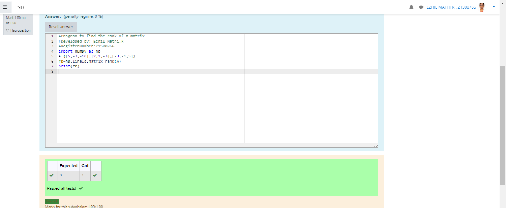

# RANK-OF-A-MATRIX
## Aim:
To write a python program to find the rank of a matrix
## Equipment’s required:
1. 	Hardware – PCs
2. 	Anaconda – Python 3.7 Installation / Moodle-Code Runner
## Algorithm:
### Step 1:
to find the rank of the matrix 
### Step 2: 
import numpy as a np 
### Step 3: Using the np.linalg.matrix_rank(), we can find the rank of the given matrix.
### Step 4: 
Print the result.
## Program:
```
#Program to find the inverse of a matrix.
#Developed by: EZHIL MATHI
#RegisterNumber: 21500766
import numpy as np
A=np.array([[1,0,3],[-1,2,-2],[2,3,-1]])
value=np.linalg.inv(A)
print(value)
```
## Output:

## Result:
Thus the rank for the given matrix is successfully solved by  using a python program.

